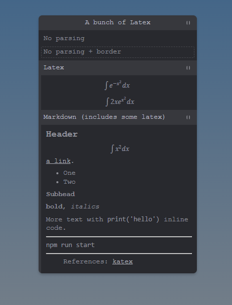

# tweakpane-latex

This is an *latex* plugin for [Tweakpane](https://cocopon.github.io/tweakpane/). Basically allows you to write natural text, markdown, and latex for descriptions etc. 



This implementation is heavily based on the [doersino's infodump plugin](https://github.com/doersino/tweakpane-plugin-infodump). It's just that his doesn't have latex.

## Installation

### Browser

Download the most recent release from [here](https://github.com/curtisjhu/tweakpane-latex/releases).
Or use the CDN files `https://unpkg.com/tweakpane-latex/dist/tweakpane-latex.js`, or `https://unpkg.com/tweakpane-latex/dist/tweakpane-latex.min.js` for a minified version.
```html
<!-- tweakpane 3x use tweakpane-latex@1.2 -->
<script src="tweakpane.min.js"></script>
<script src="tweakpane-latex.min.js"></script>
<script>
  const pane = new Tweakpane.Pane();
  pane.registerPlugin(TweakpaneLatexPlugin);
</script>

<!-- tweakpane 4x use tweakpane-latex@1.3 -->
<script type="module">
  import { Pane } from "tweakpane.min.js";
  import * as TweakpaneLatexPlugin from "tweakpane-latex.min.js";

  const pane = new Pane();
  pane.registerPlugin(TweakpaneLatexPlugin);
</script>
```


### Package
```
npm i tweakpane-latex
```
For esm
```js
import { Pane } from 'tweakpane';
import * as TweakpaneLatexPlugin from 'tweakpane-latex';

const pane = new Pane();
pane.registerPlugin(TweakpaneLatexPlugin);
```
For node
```js
const { Pane } = require("tweakpane");
const TweakpaneLatexPlugin = require('tweakpane-latex');

const pane = new Pane();
pane.registerPlugin(TweakpaneLatexPlugin);
```

## Usage

No parsing
```js
pane.addBlade({
  view: "latex",
  content: "No parsing",
});
```

No parsing + border
```js
pane.addBlade({
  view: "latex",
  content: "No parsing + border",
  border: true,
});
```
Latex only. This uses Katex and the settings from `latexSettings` will be passed into [katex's options](https://katex.org/docs/options.html)
```js
pane.addBlade({
  view: "latex",
  content: "\\begin{equation} \\int e^{-x^2} dx \\end{equation}",
  latex: true,
  latexSettings: {} // optional
});
```

Markdown. This uses [markedjs](https://marked.js.org/) and a [katex extension](https://github.com/UziTech/marked-katex-extension) so you have both Markdown + Latex. The settings you pass into `latexSettings` will be passed into [katex's options](https://katex.org/docs/options.html) like above. The settings you pass into `markedSettings` will be passed into [marked.js's options](https://github.com/UziTech/marked-katex-extension)

```js
pane.addBlade({
      view: "latex",
      markdown: true,
      markdownSettings: {} // optional
      content:
`
# Header

$$\\int x^2 dx$$

[a link](http://www.google.com).
`
})
```

## Development

### Quick start

Clone this repository, then:

* Install dependencies:

  ```
  $ npm install
  ```

* Build source codes and watch changes:

  ```
  $ npm start
  ```

* Open `test/browser.html` to see the result or run `npm run budo` for a commonjs environment version

* Cutting a release:

  ```
  $ npm run assets
  ```

  Then upload the resulting ZIP file to GitHub.

### File structure

```
|- src
|  |- sass ............ Plugin CSS
|  |- index.ts ........ Entrypoint
|  |- plugin.ts ....... Plugin
|  |- controller.ts ... Controller for the custom view
|  `- view.ts ......... Custom view
|- dist ............... Compiled files
`- test
   `- browser.html .... Plugin lab
```


